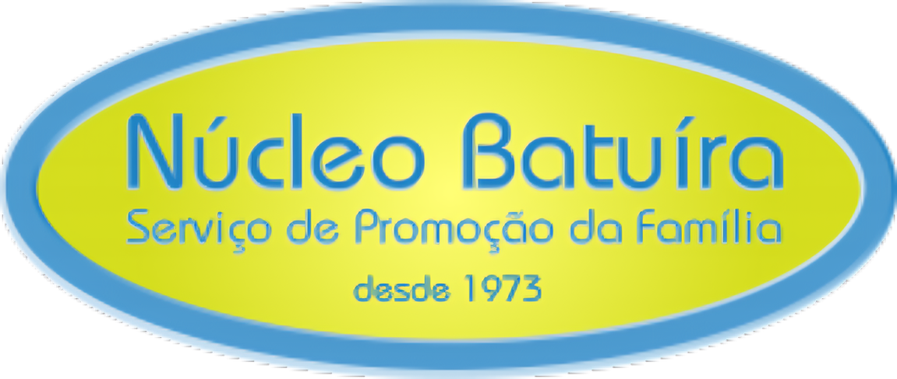

# 🩺 Sistema de Gestão Digital — Núcleo Batuíra




> Solução digital desenvolvida como projeto de estágio para a **OSC Núcleo Batuíra Serviços de Promoção à Família**, localizada em Guarulhos/SP. O sistema busca centralizar informações técnicas e administrativas, reduzir o uso de planilhas e documentos físicos e facilitar o trabalho da equipe responsável pelo atendimento aos idosos acolhidos.

---

## 📖 Sobre o Projeto

O projeto consiste em um sistema web com **Frontend e Backend integrados**.

Por meio dele, os usuários podem acessar telas administrativas, consultar e cadastrar informações e enviar dados para uma API desenvolvida em Flask. Esses dados são armazenados em um banco de dados SQLite.

O sistema foi desenvolvido como um **MVP acadêmico**, com o objetivo de demonstrar o funcionamento das principais telas, da API e da integração com o banco de dados.

## 🎯 Objetivos

- Centralizar informações administrativas, técnicas e assistenciais.
- Reduzir o uso de planilhas e documentos físicos.
- Facilitar a consulta e o cadastro de informações.
- Melhorar a comunicação entre os diferentes setores.
- Demonstrar a integração entre Frontend, Backend e banco de dados.

## 🛠️ Tecnologias Utilizadas

- **Frontend:** HTML, CSS, JavaScript e Bootstrap.
- **Backend:** Python, Flask, Flask-CORS e autenticação com JWT.
- **Banco de Dados:** SQLite.
- **Integração:** API REST com requisições HTTP e respostas em JSON.
- **Versionamento:** Git e GitHub.

## 📁 Estrutura do Projeto

```text
nucleo-batuira/
├── backend/
│   ├── app.py
│   ├── batuira.db
│   ├── requirements.txt
│   └── ...
│
├── frontend/
│   ├── css/
│   ├── imgs/
│   ├── js/
│   │   └── api.js
│   ├── login.html
│   └── ...
│
├── iniciar_projeto.bat
├── LICENSE.md
└── README.md
```

> A estrutura pode sofrer pequenas alterações conforme o desenvolvimento do projeto.

## 🔗 Como a Integração Funciona

1. O usuário preenche um formulário ou realiza uma ação em uma página HTML.
2. O JavaScript utiliza `fetch()` para enviar uma requisição à API Flask.
3. O Flask recebe e valida os dados da requisição.
4. O Backend executa uma consulta ou alteração no banco SQLite.
5. A API devolve uma resposta no formato JSON.
6. O JavaScript interpreta a resposta e atualiza as informações exibidas na página.

O endereço principal da API utilizado pelo Frontend está configurado no arquivo:

```text
frontend/js/api.js
```

## ▶️ Como Executar no Windows

### Opção rápida

Execute o arquivo:

```text
iniciar_projeto.bat
```

O arquivo abrirá duas janelas de terminal:

- uma para executar o Backend Flask;
- outra para executar o servidor do Frontend.

Depois, acesse no navegador:

```text
http://127.0.0.1:5500/login.html
```

### Execução manual

#### 1. Executar o Backend

Abra um terminal na pasta do projeto e use os comandos:

```bat
cd backend
python -m venv venv
venv\Scripts\activate
pip install -r requirements.txt
python app.py
```

A API ficará disponível, normalmente, em:

```text
http://127.0.0.1:5000
```

#### 2. Executar o Frontend

Abra outro terminal e use os comandos:

```bat
cd frontend
python -m http.server 5500
```

Depois, acesse:

```text
http://127.0.0.1:5500/login.html
```

## ✅ Funcionalidades do MVP

Entre as funcionalidades desenvolvidas ou previstas no escopo do projeto estão:

- Autenticação de usuários.
- Controle de acesso por tipo de usuário.
- Dashboard com informações resumidas.
- Cadastro e consulta de usuários.
- Cadastro e consulta de acolhidos.
- Cadastro e consulta de documentos.
- Comunicação entre o Frontend e a API Flask.
- Armazenamento das informações no banco SQLite.

## 📋 Roadmap do Projeto

O sistema foi desenvolvido como um MVP acadêmico e poderá receber melhorias futuras.

- [ ] Aprimorar a troca obrigatória de senha no primeiro acesso.
- [ ] Expandir os dashboards por nível de acesso.
- [ ] Adicionar filtros avançados na consulta de acolhidos.
- [ ] Expandir os prontuários e planos assistenciais, como PIA e PTS.
- [ ] Desenvolver ou ampliar o módulo financeiro.
- [ ] Melhorar as validações e mensagens de erro.
- [ ] Preparar o sistema para hospedagem em um servidor online.
- [ ] Avaliar a migração do SQLite para outro banco em uma versão de produção.

## ⚠️ Observações

- Este projeto foi criado para fins acadêmicos.
- Na execução local, o banco de dados fica armazenado no computador que está executando o Backend.
- Para que diferentes computadores utilizem os mesmos dados pela internet, será necessário hospedar o Backend e o banco de dados em um servidor.
- As informações, nomes e documentos usados para testes devem ser fictícios.

## 🤝 Colaboradores

Desenvolvedores que contribuíram para este projeto:

<table>
  <tr>
    <td align="center">
      <a href="#" title="GitHub do Ryan">
        <br>
        <sub><b>Ryan Santos Dias</b></sub>
      </a>
    </td>
    <td align="center">
      <a href="#" title="GitHub do João">
        <br>
        <sub><b>João Victor Hociko de Jesus Borges</b></sub>
      </a>
    </td>
    <td align="center">
      <a href="#" title="GitHub do Alexandre">
        <br>
        <sub><b>Alexandre Lemes dos Anjos</b></sub>
      </a>
    </td>
    <td align="center">
      <a href="#" title="GitHub do Andrey">
        <br>
        <sub><b>Andrey Arthur Ramos de Oliveira</b></sub>
      </a>
    </td>
  </tr>
</table>

Agradecemos também ao corpo docente da **Faculdade ENIAC** e à coordenação do **Núcleo Batuíra** pelo suporte durante o desenvolvimento deste desafio.

## 📝 Licença

Este projeto está sob licença. Consulte o arquivo [LICENSE.md](LICENSE.md) para mais detalhes.
